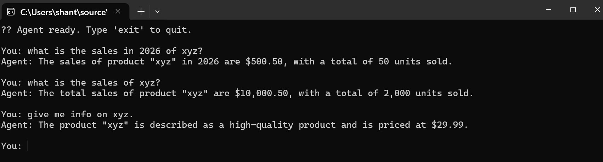
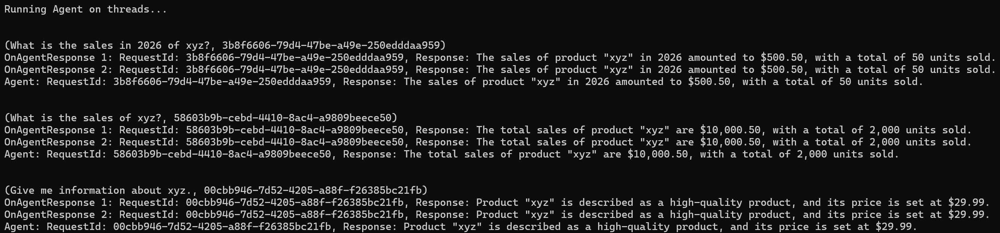
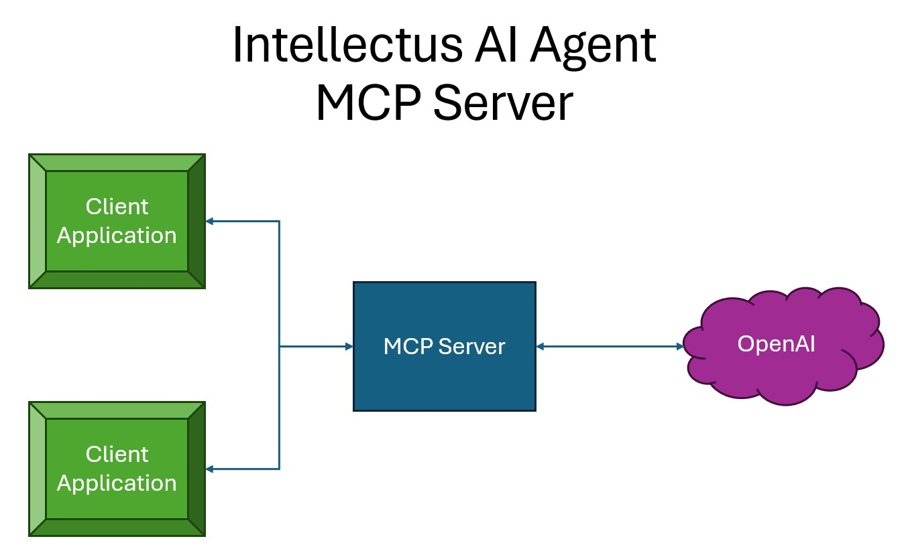

# Intellectus AI Agent Framework for .NET

|**Packages**|Version|Downloads|
|---------------------------|:---:|:---:|
|*Intellectus.AIAgent.Framework*|[](https://www.nuget.org/packages/Intellectus.AIAgent.Framework)|[](https://www.nuget.org/packages/Intellectus.AIAgent.Framework)|

## Overview

Library provides an `OpenAI Agent` for .NET applications. 

The agent is designed to facilitate communication between your application and `OpenAI's large language models (LLMs)`, 

enabling you to build intelligent conversational interfaces.

You can tell the Agent about your tools & the Agent can figure out which tool to use, given a natural language input.

You have

* a [`Framework`](#framework).
* a [`MCP Server`](#model-context-protocol-mcp-server).
* a [`.NET Client for MCP Server`](#net-client-for-mcp-server).

## Framework

* [`Tools - Step 1`](#tools-step-1)
* [`Wire up the Tools - Step 2`](#wire-up-the-tools-step-2)
  * [`Using Dependency Injection`](#using-dependency-injection)
  * [`Without using Dependency Injection`](#without-using-dependency-injection)
* [`Agent Response`](#agent-response)
* [`Running Agent on threads`](#running-agent-on-threads)
* [`Event handlers`](#event-handlers)
  * [`General purpose event handler`](#general-purpose-event-handler)
  * [`Tool specific event handler`](#tool-specific-event-handler)

## Tools - Step 1

Create your tools by implementing the `ITool` interface. 

This interface defines the structure and behavior of your tools, allowing them to be seamlessly integrated into the agent framework.

The Agent can pass multiple inputs to the `ExecuteAsync` method of the tools, and the tools can return any object as output.

The multiple inputs are based on the `reasoning result` that you provide when creating the Agent instance.

### Interface

```csharp
public interface ITool
{
    string Name { get; }
    string Description { get; }
    Task<object> ExecuteAsync(params string[] input);
}
```

[`Back to Framework`](#framework)

### Sample Tool Implementation

Let us say you have 2 tools. A Product tool & a Sales tool.

```csharp
public class Constants
{
    public const string PRODUCT_TOOL_NAME = "ProductTool";
    public const string SALES_TOOL_NAME = "SalesTool";
}
```

#### Product tool

The `ExecuteAsync` method of the ProductTool class takes a product name as input and returns product information.

```csharp
public class ProductData
{
    public string ProductName { get; set; } = string.Empty;
    public string Description { get; set; } = string.Empty;
    public decimal Price { get; set; }
}

public class ProductTool : ITool
{
    public string Name => Constants.PRODUCT_TOOL_NAME;
    public string Description => "Provides product information for a given product. Input: product name.";

    public Task<object> ExecuteAsync(params string[] input)
    {
        return Task.FromResult((object)new ProductData
        {
            ProductName = input[0],
            Description = "A high-quality product.",
            Price = 29.99m
        });
    }
}
```

[`Back to Framework`](#framework)

#### Sales tool

The `ExecuteAsync` method of the SalesTool class takes a product name and an optional year as input.

```csharp
public class SalesData
{
    public string ProductName { get; set; } = string.Empty;
    public decimal TotalSales { get; set; }
    public int UnitsSold { get; set; }
    public int? Year { get; set; } = null; // Optional, default to null if not provided
}

public class SalesTool : ITool
{
    public string Name => Constants.SALES_TOOL_NAME;
    public string Description => "Provides sales data for a given product. Input: product name, year.";        

    public Task<object> ExecuteAsync(params string[] input)
    {
        var productName = input[0].Trim();
        var year =
            input.Length > 1
            ?
            int.Parse(input[1].Trim())
            :
            0;

        return Task.FromResult((object) 
        (year == 0 
        ?
        //Total sales and units sold for the product without year
        new SalesData
        {
            ProductName = productName,
            TotalSales = 10000.50m,
            UnitsSold = 2000
        }            
        :
        //Total sales and units sold for the product for the specified year
        new SalesData
        {
            ProductName = productName,
            TotalSales = 500.50m,
            UnitsSold = 50,
            Year = year
        }));
    }
}
```

[`Back to Framework`](#framework)

## Wire up the Tools - Step 2

Wire up the tools in your application and register them with the agent framework.

Add the settings with `OpenAI details (API Key, LLM)`, the `list of tools` and the `reasoning result`.

The tools can be dependency injected too.

The reasoning result is a string that describes the output format of the reasoning which is the expected input for the tools.

The agent will use this information to understand how to interact with the tools during conversations.

In the example, ProductName will be passed to Product tool and ProductName and/or Year (optional) to the Sales tool.

[`Back to Framework`](#framework)

### Using Dependency Injection

Use extension `AddIntellectusAIAgentFramework` to wire up the framework for DI.

```csharp
using AgentFramework.Demo;
using Intellectus.AIAgent.Framework;
using Microsoft.Extensions.DependencyInjection;

var apiKey = Environment.GetEnvironmentVariable("OPENAI_API_KEY");
if (string.IsNullOrWhiteSpace(apiKey))
{
    Console.WriteLine("Please set the OPENAI_API_KEY environment variable.");
    return;
}

// Create an Agent with the configured settings
var services = new ServiceCollection();

// Register tools with DI
services.AddScoped<ITool, SalesTool>();
services.AddScoped<ITool, ProductTool>();

// Register the framework and configure settings
services.AddIntellectusAIAgentFramework(settings =>
{
    settings.OpenAIAPIKey = apiKey;
    settings.OpenAILLMModel = "gpt-4o-mini";
    settings.ReasoningResult = @"<ProductName>:<Year>
                                    Year is optional.
                                ";
    //Add tools without using DI
    //settings.Tools = new List<ITool> { new SalesTool(), new ProductTool() };
});

var sp = services.BuildServiceProvider();

var agent = sp.GetRequiredService<IAgent>();

Console.WriteLine("Agent ready. Type 'exit' to quit.\n");

while (true)
{
    Console.Write("You: ");
    var input = Console.ReadLine();
    if (string.Equals(input, "exit", StringComparison.OrdinalIgnoreCase))
        break;

    var response = await agent.RespondAsync(input);
    Console.WriteLine($"Agent: {response.Response}\n");
}
```

[`Back to Framework`](#framework)

### Without using Dependency Injection

Use the `AgentBuilder` to build the Agent.

```csharp
using AgentFramework.Demo;
using Intellectus.AIAgent.Framework;

var apiKey = Environment.GetEnvironmentVariable("OPENAI_API_KEY");

var agent = new AgentBuilder()
                .AddTool(new ProductTool())
                .AddTool(new SalesTool())
                .AddOpenAIAPIKey(apiKey)
                .AddOpenAILLM("gpt-4o-mini")
                .AddReasoningResult(@"<ProductName>:<Year>
                                        Year is optional.
                                     ")
                .ToAgent();

Console.WriteLine("Agent ready. Type 'exit' to quit.\n");

while (true)
{
    Console.Write("You: ");
    var input = Console.ReadLine();
    if (string.Equals(input, "exit", StringComparison.OrdinalIgnoreCase))
        break;

    var response = await agent.RespondAsync(input);
    Console.WriteLine($"Agent: {response.Response}\n");
}
```

[`Back to Framework`](#framework)

## Agent Response

The `Agent` returns below `AgentResponse`.

The `ToolOutput` property contains the object returned by the Tool.

```csharp
public class AgentResponse
{
    public string RequestId { get; set; } = string.Empty;
    public string Response { get; set; } = string.Empty;
    public string ReasoningResult { get; set; } = string.Empty;
    public string ToolName { get; set; } = string.Empty;
    public object? ToolOutput { get; set; } = null;
    public string Error { get; set; } = string.Empty;
}
```

[`Back to Framework`](#framework)

## Running Agent on threads

You can run the Agent on threads.

You subscribe to events to get the Agent's response asynchronously.

Provide a `RequestId` to Agent's `RespondThreadAsync` method to co-relate it to the response.

This method returns a response too.

[`Back to Framework`](#framework)

## Event handlers

The framework supports 2 types of event handlers.

* General purpose - gets the response for all Tools.
* Tool specific - gets the response specific for a Tool.

[`Back to Framework`](#framework)

### General purpose event handler

You subscribe to event `OnAgentResponse` to get the Agent's response asynchronously.

This event gets all the events for all tools.

If needed, you can have multiple event handlers to process the response differently.

[`Back to Framework`](#framework)

### Tool specific event handler

You can add event handlers specific for a tool.

So, only events for that tool are published to that handler.

If needed, you can add multiple handlers for the same tool to process the response differently.

You can use the `Filter` to specify which response gets published to the handler.

[`Back to Framework`](#framework)

```csharp
Console.WriteLine("Running Agent on threads...");

var inputs = new List<(string input, string reqId)>()
{ 
    ("What is the sales in 2026 of xyz?", Guid.NewGuid().ToString()),
    ("What is the sales of xyz?", Guid.NewGuid().ToString()),
    ("Give me information about xyz.", Guid.NewGuid().ToString())
};

// General purpose event handler for all tools.
// You can add multiple.
agent.OnAgentResponse += async response =>
{
    Console.WriteLine($"OnAgentResponse: RequestId: {response.RequestId}, Tool Name: {response.ToolName}, Response: {response.Response}");
};

// Tool specific event handler.
// You can Add multiple for the same tool.
agent.OnAgentToolResponse.Add(new AgentToolResponseEvent 
{
    ToolName = Constants.PRODUCT_TOOL_NAME,    
    OnAgentResponse = HandleProductToolResponse
});

agent.OnAgentToolResponse.Add(new AgentToolResponseEvent
{
    ToolName = Constants.SALES_TOOL_NAME,
    Filter = response => ((SalesData)response.ToolOutput!).Year == null,
    OnAgentResponse = HandleSalesToolByTotalResponse
});

agent.OnAgentToolResponse.Add(new AgentToolResponseEvent
{
    ToolName = Constants.SALES_TOOL_NAME,
    Filter = response => ((SalesData)response.ToolOutput!).Year > 0,
    OnAgentResponse = HandleSalesToolByYearResponse
});

foreach (var input in inputs)
{
    Console.WriteLine(Environment.NewLine);
    Console.WriteLine(input);
    var response = await agent.RespondThreadAsync(input.input, input.reqId);
    Console.WriteLine($"Agent: RequestId: {response.RequestId}, Tool Name: {response.ToolName}, Response: {response.Response}");
    //OR
    //var response = await Task.Run(async () => await agent.RespondAsync(input.input, input.reqId));
}

Console.ReadLine();

async Task HandleProductToolResponse(AgentResponse response)
{
    Console.WriteLine($"{Constants.PRODUCT_TOOL_NAME} event: RequestId: {response.RequestId}, Response: {response.Response}");
}

async Task HandleSalesToolByTotalResponse(AgentResponse response)
{
    Console.WriteLine($"{Constants.SALES_TOOL_NAME} by Total event: RequestId: {response.RequestId}, Response: {response.Response}");
}

async Task HandleSalesToolByYearResponse(AgentResponse response)
{
    Console.WriteLine($"{Constants.SALES_TOOL_NAME} by Year event: RequestId: {response.RequestId}, Response: {response.Response}");
}
```

[`Back to Framework`](#framework)

[`Back to Overview`](#overview)





## Model Context Protocol (MCP) Server

You can use the `Intellectus.AIAgent.MCPServer` package to build an MCP Server.

All your Tools reside in your Server. The Server communicates with OpenAI LLMs.

The Clients talk to the Server using HTTP/stdio and get a response back.



## Sample Server

Create a Console project.

In the .csproj,

change the SDK to Web as shown below:

```
<Project Sdk="Microsoft.NET.Sdk.Web">
```

and add below properties in the PropertyGroup.

```
<RuntimeIdentifiers>win-x64;win-arm64;osx-arm64;linux-x64;linux-arm64;linux-musl-x64</RuntimeIdentifiers>

<!-- Set up the MCP server to be a self-contained application that does not rely on a shared framework -->
<SelfContained>true</SelfContained>
<PublishSelfContained>true</PublishSelfContained>

<!-- Set up the MCP server to be a single file executable -->
<PublishSingleFile>true</PublishSingleFile>
```

Then, hook up your server in Program.cs as shown below:

```csharp
using Intellectus.AIAgent.Framework;
using Intellectus.AIAgent.MCPServer;
using MCPServer.Sample;

Console.WriteLine("Intellectus AI Agent MCP Server...");

var builder = WebApplication.CreateBuilder(args);

var apiKey = Environment.GetEnvironmentVariable("OPENAI_API_KEY");

// Register tools with DI
builder.Services.AddScoped<ITool, SalesTool>();
builder.Services.AddScoped<ITool, ProductTool>();

// Register the server and configure settings
builder.Services.AddIntellectusMCPServer(settings =>
{
    settings.OpenAIAPIKey = apiKey;
    settings.OpenAILLMModel = "gpt-4o-mini";
    settings.ReasoningResult = @"<ProductName>:<Year>
                                    Year is optional.
                                ";
    //Add tools without using DI
    //settings.Tools = new List<ITool> { new SalesTool(), new ProductTool() };
});

var app = builder.Build();

app.UseIntellectusMCPServer();

await app.RunAsync();
```

To call the MCP Server using HTTP, use a JSON request like below:

POST: {BaseUrl}/mcp

```json
{
  "jsonrpc": "2.0",
  "id": 1,
  "method": "tools/call",
  "params": {
    "name": "ai_agent_respond",
    "arguments": {
      "userInput": "<--Your input here-->"
    }
  }
}
```

[Sample MCP Server](/MCPServer.Sample)

[Sample Client](/MCPServer.Client.Sample)

[Tests](/AIAgentFrameworkTests/MCPServerTests.cs)

[`Back to Overview`](#overview)

## .NET Client for MCP Server

There is a .NET client library `Intellectus.AIAgent.MCPServer.Client` that you can use to call the MCP Server.

Read [**more**](Intellectus.AIAgent.MCPServer.Client/README.md).

[.NET Client Tests](/AIAgentFrameworkTests/MCPClientTests.cs)

[`Back to Overview`](#overview)